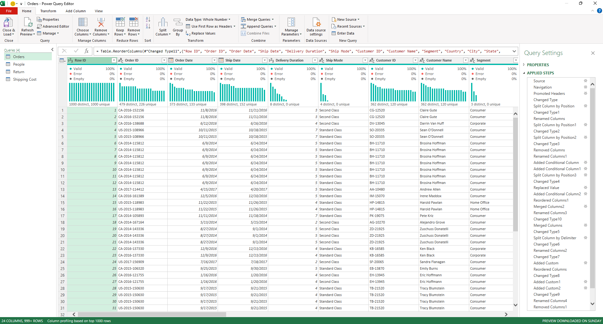
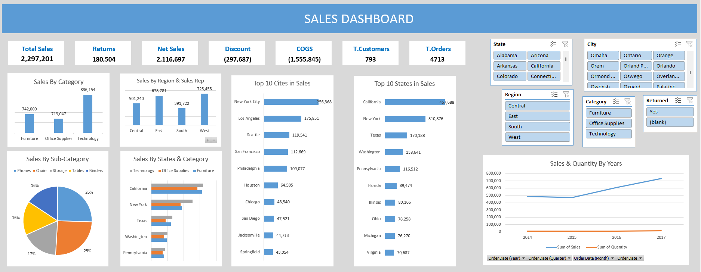

# Advanced Excel Sales Dashboard (Global Superstore)

This project demonstrates an end-to-end BI solution built entirely within Microsoft Excel. The goal was to transform raw, disconnected data files into a fully interactive sales dashboard.

---

### 1. The Problem: Raw, Disconnected Data

The initial data was fragmented across **3 separate Excel files**:
1.  A primary `Orders` table.
2.  A `Returns` table.
3.  A `Person` table
4.  A `Shipping Cost` lookup table.

The data was "raw" and unusable for direct analysis, requiring significant cleaning, transformation, and modeling.

---

### 2. The Solution: ETL & Data Modeling in Excel

I used Excel's advanced BI tools (Power Query & Power Pivot) to build an automated and scalable data pipeline.

**A) ETL (Power Query):**
I used Power Query to connect to all 3 data sources. The process involved:
* **Cleaning:** Handling missing values (`NULLs`) and formatting data types.
* **Transforming:** Unpivoting data and merging queries to link the `Returns` and `Shipping Cost` data to the main `Orders` table.

**B) Data Modeling (Power Pivot):**
Instead of using `VLOOKUP`, a robust **Star Schema Data Model** was built in Power Pivot. This connects the fact table (`Orders`) to dimension tables (`People`), ensuring high performance and accurate analysis.

**C) DAX (Data Analysis Expressions):**
Custom measures were written in DAX (within Power Pivot) to create key performance indicators (KPIs) that did not exist in the original data, such as:
* `[Net Sales]`
* `[COGS] (Cost of Goods Sold)`
* `[Total Profit]`
* `[Profit Percentage]`

---

### 3. The Result: The Interactive Dashboard

The final product is a dynamic dashboard that allows users to filter sales performance by Region, Category, and Employee. It provides clear, actionable insights into the company's performance.

