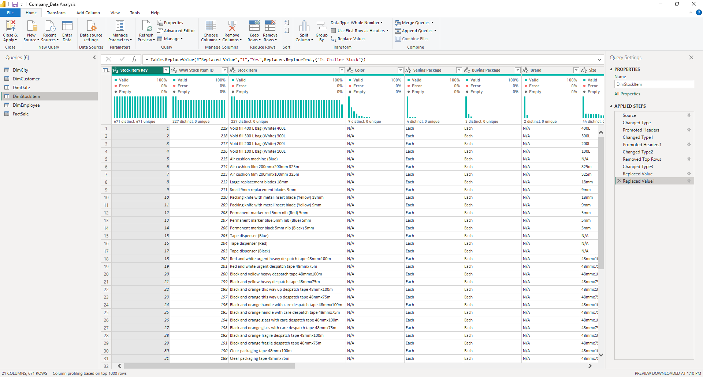
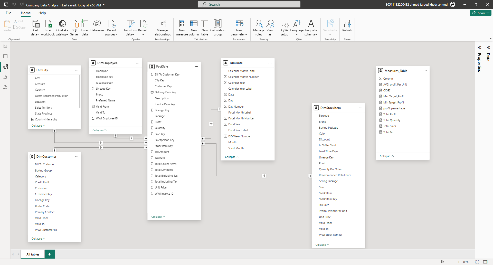

# Power BI Sales & Profit Dashboard (Wide World Importers)

This project is a comprehensive, end-to-end Business Intelligence solution analyzing sales, profit, and performance drivers for the "Wide World Importers" (WWI) company.

---

### 📊 1. Interactive Dashboard Demo (GIF)

(This is a 15-second silent GIF demonstrating the report's interactivity and navigation. Please replace the link below with your uploaded GIF file.)

---

### 📹 2. Full Project Walkthrough (Video)

For a detailed explanation of the data model, DAX measures, and insights, please watch this 2-minute video walkthrough I recorded.

**[▶️ Watch the Full Video Walkthrough on YouTube (Unlisted)]**
*https://youtu.be/FvSsOWkyR5Y?si=gzRAYmB3NJXJ2Gu7*

---

### 3. The Challenge: Complex & Disconnected Data

The business data was scattered across **6 different raw data files** (1 Fact table and 5 Dimension tables like `DimCity`, `DimCustomer`, `DimEmployee`, `DimDate`, and `DimStockItem`). The data required a full ETL pipeline before any analysis could be performed.

---

### 4. The Solution: A Professional BI Pipeline

**A) ETL (Power Query):**
* All 6 source files were connected to Power BI and processed in the Power Query Editor.
* Data integrity was checked. Cleaning steps included changing data types, handling `NULL` values, and replacing values to ensure the data was accurate and ready for modeling.
* This screenshot shows the "Applied Steps" taken within Power Query to prepare the data:

**B) Data Modeling (Star Schema):**
* A robust **Star Schema Data Model** was built, connecting the central `FactSale` table to all 5 dimension tables using one-to-many relationships.
* This model is the core of the report, ensuring high performance and accurate analysis.

**C) DAX (Optimization & Measures):**
* **This report is optimized for performance.** All key calculations were written as **DAX Measures** in a dedicated `Measures_Table` instead of using resource-heavy Calculated Columns.
* This approach ensures the report is fast, scalable, and easy to maintain.
* Key measures created include: `[Total Sales]`, `[COGS]`, `[Total Profit]`, `[Profit Percentage %]`, and `[Target Profit]`.

---

### 5. Key Features & Insights

The final report is a 4-page, user-friendly tool for business leaders:

* **User-Friendly Navigation:** Uses clear buttons (`Sales`, `Profit`, `Details`) for an intuitive, app-like experience.
* **AI-Powered Insights:** The "More Specific" page uses the **Key Influencers** visual to automatically find the top drivers for increasing profit (e.g., `Sum of Quantity`).
* **Deep Analysis:**
    * A **Scatter Plot** analyzes `Profit vs. Sales` by Employee to identify high-performing staff.
    * A **Gauge Chart** measures `Total Profit` against a pre-defined `Target`.
* **Geospatial & Detailed View:** The "Details" page provides an interactive map and a drill-down table for granular analysis.
